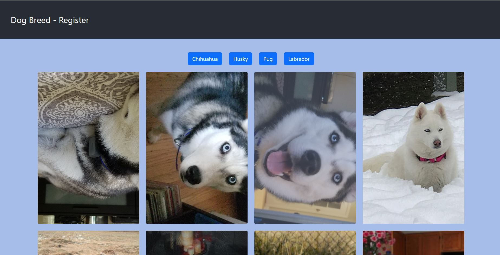

# Dog Breed Fetch.API

# About 

Esse projeto tem como objetivo contruir uma aplicação de consulta de fotos de 4 raças de cachorros. 
Tendo os seguintes parametros:
-  LogIn validado por uma API, via recebimento de um Token.
-  O Token deve ser mantido para ser enviado nas requisições das imagens das reças.

This project was bootstrapped with [Create React App](https://github.com/facebook/create-react-app).

## Available Scripts

In the project directory, you can run:

### `npm start`

Runs the app in the development mode.\
Open [http://localhost:3000](http://localhost:3000) to view it in the browser.

The page will reload if you make edits.\
You will also see any lint errors in the console.

### `npm test`

Launches the test runner in the interactive watch mode.\
See the section about [running tests](https://facebook.github.io/create-react-app/docs/running-tests) for more information.
## Learn More

You can learn more in the [Create React App documentation](https://facebook.github.io/create-react-app/docs/getting-started).

To learn React, check out the [React documentation](https://reactjs.org/).
